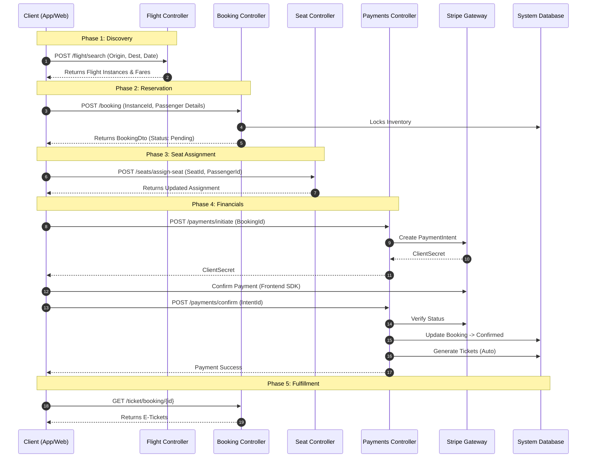

# Public API Reference (Customer Facing)

The Public API facilitates the core customer journey: searching for flights, managing passenger profiles, and creating bookings.

---

## Interactive API Explorer

For a complete list of all parameters, data types, and direct testing, please utilize our interactive documentation platform.

<div style="position: relative; padding-bottom: 56.25%; height: 0; overflow: hidden; max-width: 100%; border: 1px solid #e0e0e0; border-radius: 8px;">
    <iframe 
        src="https://share.apidog.com/762445f2-1d68-4894-b68b-6f4479003291" 
        style="position: absolute; top: 0; left: 0; width: 100%; height: 100%; border: 0;" 
        allowfullscreen>
    </iframe>
</div>

> **Tip:** Open the [Interactive Schema in a new tab ↗](https://share.apidog.com/762445f2-1d68-4894-b68b-6f4479003291) for a full-screen experience.

---

## Global Configuration

### Base URL
`https://localhost:5001/api/v1`

### Authentication
All endpoints (except `Flight Search`) require a valid JWT.

* **Header:** `Authorization: Bearer <your_jwt_token>`
* **Scheme:** Bearer

### Common Response Codes
| Code | Description |
| :--- | :--- |
| `200` | **OK**. The request was successful. |
| `201` | **Created**. A new resource (e.g., Booking) was created. |
| `400` | **Bad Request**. Validation failed (check response body for errors). |
| `401` | **Unauthorized**. API Key/Token is missing or invalid. | 

---
  
 
## The Booking Workflow

The following sequence diagram illustrates the required orchestration between the Client (Frontend) and the Asiaporeair Backend Services.



-----

---

## Pre-Requisite: Login

Before initiating bookings or payments, you must authenticate as a user to obtain a JWT.

**Request Body**
```json
{
  "email": "david.jone@asiapore.com",
  "password": "Userword123!"
}
```

**Response (200 OK)**

```json
{
  "message": "Login successful.",
  "token": "eyJhbGciOiJIUzI1NiIsInR5cCI6IkpXVCJ9...", 
  "isAuthenticated": true,
  "roles": [
    "User"
  ]
}
```

> **Action:** Copy the `token` string and use it in the Authorization header for Phase 2 onwards.

-----


## Phase 1: Flight Discovery

### Search Flights

Performs a comprehensive availability check. The system supports `OneWay`, `RoundTrip`, and `MultiCity` logic.

  * **Endpoint:** `POST /api/v1/Flight/search`
  * **Access:** Public

**Request Body**

```json
{
  "searchType": "OneWay",
  "passengers": {
    "adults": 1,
    "children": 0,
    "infants": 0
  },
  "segments": [ 
    {
      "originIataCode": "SIN",
      "destinationIataCode": "LHR",
      "departureDate": "2026-03-01T23:30:00Z"
    }
  ],
  "cabinClassPreference": "Economy",
  "includeFlexibleFares": true
}
```

**Response (200 OK)**

```json
[
    {
      "itineraryId": "80399b5e-10f0-4351-bec0-7752347b1956",
      "outboundSegments": [
        {
          "flightInstanceId": 1,
          "flightNumber": "SQ322",
          "airlineName": "Singapore Airlines",
          "airlineIataCode": "SQ",
          "aircraftModel": "A380-800",
          "originAirportIata": "SIN",
          "originAirportName": "Singapore Changi Airport",
          "originCity": "Singapore",
          "departureTime": "2026-03-03T23:30:00",
          "destinationAirportIata": "LHR",
          "destinationAirportName": "London Heathrow Airport",
          "destinationCity": "London",
          "arrivalTime": "2026-03-04T05:55:00",
          "durationMinutes": 385
        }
      ],
      "inboundSegments": null,
      "fareOptions": [
        {
          "fareBasisCode": "EONE",
          "fareName": "Economy Class - One-Way Standard",
          "cabinClass": "Economy",
          "pricePerAdult": 3000,
          "pricePerChild": 2400,
          "pricePerInfant": 300,
          "baggageAllowance": "23kg",
          "isChangeable": false,
          "isRefundable": false,
          "availableSeats": 467
        }
		  ,.....
	  ],
      "totalDurationMinutes": 385,
      "numberOfStops": 0
    }
]
```

-----

## Phase 2: Creation

### Create Booking

Initializes a reservation. This endpoint is **atomic**: it validates the flight status, checks capacity, creates the passenger records, and calculates the total price in one transaction.

  * **Endpoint:** `POST /api/v1/Booking`
  * **Access:** Authorized User

**Request Body**

```json
{
  "flightInstanceId": 1,          // From Search Result
  "fareBasisCode": "EONE",
  "passengers": [
    {
      "firstName": "John",
      "lastName": "Doe",
      "dateOfBirth": "1995-11-26T19:13:21.568Z",
      "passportNumber": "A1234567"
    }
  ],
  "ancillaryPurchases": [
    {
      "productId": 1,            // e.g., 'Extra Baggage 20kg'
      "quantity": 1,
      "segmentId": 1
    }
  ]
}
``` 

**Response (201 Created)**

```json
{
    "bookingId": 41,                           // <--- SAVE THIS ID
    "bookingReference": "7D488162",            // <--- SAVE THIS Reference
    "bookingTime": "2025-11-26T19:15:27.9953852",
    "totalPrice": 3050,
    "paymentStatus": "Pending",
    "flightNumber": "SQ322",
    "flightDepartureTime": "2026-03-03T23:30:00",
    "originAirportCode": "SIN",
    "destinationAirportCode": "LHR",
    "fareBasisCode": "EONE",
    "passengers": [
      {
        "passengerId": 42,                      // <--- SAVE THIS ID
        "linkedUserId": 3,
        "firstName": "John",
        "lastName": "Doe",
        "dateOfBirth": "1995-11-26T19:13:21.568",
        "passportNumber": "A1234567",
        "frequentFlyerCardNumber": "APFF-00003"
      }
    ]
  }
```

### Get My Bookings

Retrieves a paginated list of bookings belonging *only* to the authenticated user.

  * **Endpoint:** `GET /booking/my-bookings`
  * **Query Parameters:**
      * `pageNumber` (int, default: 1)
      * `pageSize` (int, default: 10)

### Cancel Booking

Cancels a booking if permissible (e.g., not within 2 hours of departure).

  * **Endpoint:** `POST /booking/{bookingId}/cancel`
  * **Access:** `User` (Must own the booking)

---

### Passenger Profiles

Endpoints for managing saved travel companions linked to the user's profile for faster checkout.

  * `GET /booking/my-passengers`: List saved passengers.
  * `PUT /booking/passengers/{id}`: Update passenger details.
 
---

## Phase 3: Seat Selection

### Assign Seat

Assigns a specific seat to a passenger. This must be done before check-in, though it is optional before payment (depending on fare rules).

  * **Endpoint:** `POST /api/v1/Seats/assign-seat`
  * **Access:** Authorized User (Owner)

**Request Body**

```json 
{
  "bookingId": 41,
  "passengerId": 42,
  "seatId": "9V-SKA-31A"      // Must exist in Aircraft Configuration
}
```

**Response (200 OK)**

```json
{
  "message": "Seat assigned successfully" 
}
```

-----

## Phase 4: Payment Processing

Asiaporeair uses **Stripe** for secure payments. This is a two-step process: Initiation and Confirmation.

### 1. Initiate Payment

Calculates the final amount and contacts Stripe to generate a secure `PaymentIntent`.

  * **Endpoint:** `POST /api/v1/Payments/initiate`
  * **Access:** Authorized User

**Request Body**

```json
{
  "bookingId": 41,
  "amountOverride": 0,   // Leave 0 to use Booking Total
  "currency": "usd"
}
```

**Response (200 OK)**

```json
{
  "statusCode": 200,
  "message": "Payment Intent created. Proceed to Stripe Gateway.",
  "data": {
    "paymentIntentId": "pi_3Mtw...",     // Stripe Transaction ID
    "clientSecret": "pi_3Mtw..._secret_...",
    "publishableKey": "pk_test_...",
    "amount": 3050,
    "currency": "usd"
  }
}
```

### 2. Confirm Payment

After the frontend successfully collects payment details using the `clientSecret`, this endpoint is called to verify the transaction and trigger ticket generation.

  * **Endpoint:** `POST /api/v1/Payments/confirm`
  * **Access:** Authorized User

**Request Body**

```json
{
  "paymentIntentId": "pi_3Mtw...",
  "paymentMethodId": "pm_card_vis", // Optional if handled by Frontend SDK
  "returnUrl": "https://asiaporeair.com/payment/success"
}
```

**Response (200 OK)**

```json
{
  "statusCode": 200,
  "message": "Payment confirmed successfully and is Succeeded.",
  "data": {
    "paymentIntentId": "pi_3Mtw...",
    "status": "succeeded"
  }
}
```

> **System Note:** Upon a successful response here, the `TicketService` automatically generates tickets for all passengers in the booking.
 
### Webhook Confirmation (Async, Server-to-Server)

  * **Endpoint:** `POST /api/v1/webhook/stripe`
  * **Access:** Stripe Servers Only (Secured by Signature Verification)
  * **Goal:** **Finalize Booking** (`Status` = Confirmed) and **Generate E-Tickets**.

> **Note:** This endpoint is not called by the public client. Its existence is crucial for reliability.

### Local Development Testing

During development, you simulate the Stripe webhook using the Stripe CLI:

1.  **Start Listening:** Use the command provided by Stripe to tunnel webhook events to your local API endpoint:
    ```bash
    stripe listen --forward-to https://localhost:7040/api/v1/webhook/stripe
    ```
2.  **Trigger Event:** Manually simulate a successful payment event and include the required `BookingId` in the Payment Intent's metadata so your service can correctly link the payment to the booking:
    ```bash
    stripe trigger payment_intent.succeeded --add "payment_intent:metadata[BookingId]=41"
    ```

-----

## Phase 5: Ticket Fulfillment

### View Tickets

Retrieves the generated e-tickets. These are only available after the Payment Status becomes `Confirmed`.

  * **Endpoint:** `GET /api/v1/Ticket/booking/{bookingId}`
  * **Access:** Authorized User

**Response (200 OK)**

```json
[  
    {
      "ticketId": 161,
      "ticketCode": "SQ726458734",
      "bookingId": 41,
      "bookingReference": "7D488162",
      "passengerId": 42,
      "passengerName": "John Doe",
      "flightNumber": "SQ322",
      "flightDepartureTime": "2026-03-03T23:30:00",
      "seatNumber": "31A",
      "issueDate": "2025-11-26T10:40:00",
      "status": "Issued"
    } 
]
```

-----

## Phase 6: Operations

### Check-In (Ticket Status Update)

Simulates the Check-In process by updating the ticket status. In a real-world scenario, this would check strict time windows (e.g., open 48h before flight).

  * **Endpoint:** `POST /api/v1/checkin/generate`
  * **Access:** Check-In Agent / System

**Request Body**

```json
{
  "bookingId": 41,
  "passengerId": 42
}
```

**Response (200 OK)**

```json
{
  "statusCode": 201,
  "message": "Boarding pass generated successfully.",
  "data": {
    "passId": 121,
    "passengerId": 42,
    "passengerName": "John Doe",
    "frequentFlyerNumber": "N/A",
    "flightInstanceId": 1,
    "flightNumber": "SQ322",
    "originAirportCode": "SIN",
    "destinationAirportCode": "LHR",
    "departureTime": "2026-03-03T23:30:00",
    "arrivalTime": "2026-03-04T05:55:00",
    "seatNumber": "31A",
    "cabinClass": "Economy",
    "boardingTime": "2025-11-27T06:20:07.5555886Z",
    "sequenceNumber": 47,
    "precheckStatus": false,
    "bookingReference": "7D488162",
    "ticketCode": "SQ726458734"
  }
}
```
   