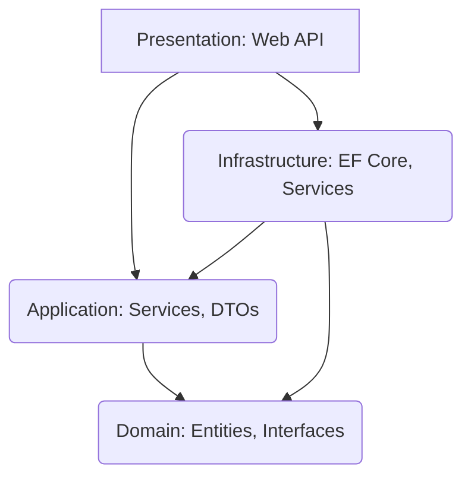

# Project Structure (Layers)

The Asiaporeair solution is divided into four main projects, strictly following the Clean Architecture pattern to manage dependencies and maintain modularity.

## 1. Solution Structure

The project solution (`Asiaporeair.sln`) contains the following four main projects:

| Project Name | Type | Key Role | Code Reference |
| :--- | :--- | :--- | :--- |
| **Domain** | .NET Class Library | **Core Business Rules** | Domain.Entities |
| **Application** | .NET Class Library | **Use Cases & Contracts** | Application.Services.Interfaces |
| **Infrastructure** | .NET Class Library | **External Implementation** | Infrastructure.Data |
| **Presentation** | ASP.NET Core Web API | **External Entry Point** | Presentation.Controllers |

## 2. Detailed Project Dependencies

Dependencies flow inward, from the outermost Presentation layer to the innermost Domain layer.

  * **Domain:** Has no dependencies on any other project.
  * **Application:** Depends only on **Domain**.
  * **Infrastructure:** Depends on **Application** and **Domain**. It implements interfaces defined in the inner layers.
  * **Presentation:** Depends on **Infrastructure** and **Application** to perform **Dependency Injection** and access application logic.

## 3\. Key Folders and Files

| Project | Folder/File | Purpose | Example File |
| :--- | :--- | :--- | :--- |
| **Domain** | Entities | Defines the core data model. | `Aircraft.cs` |
| **Domain** | Repositories.Interfaces | Defines data access contracts (Unit of Work). | `IUnitOfWork.cs` |
| **Application** | Services.Interfaces | Defines business logic contracts. | `IBookingService.cs` |
| **Application** | DTOs | Data Transfer Objects for input/output. | `AirportDto.cs` |
| **Infrastructure** | Data | EF Core setup, `DbContext`, Migrations. | `ApplicationDbContext.cs` |
| **Infrastructure** | Repositories | Implementation of Domain repository interfaces. | `AirportRepository.cs` |
| **Presentation** | Controllers | Handles API endpoints and HTTP traffic. | `AirportsController.cs` |
| **Presentation** | Extensions | Middleware and Service registration setup. | `DataSeedExtension.cs` |

 
---
 
