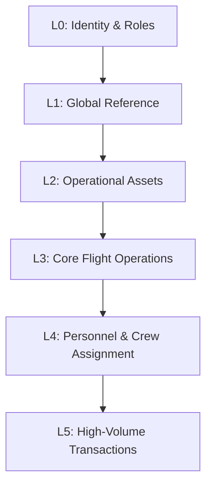

# Data Seeding Details 

**Engine:** Custom Hybrid Seeder (JSON)  
**Target Volume:** ~2.4 Thousand Records  
**Execution Time:** Varies depending on hardware (Optimized for performance and dependency management)

The **Asiaporeair** platform employs a sophisticated, multi-layered data seeding engine designed to replicate a real-world high-volume airline environment for development, testing, and performance analysis. Unlike simple script injections, our seeder utilizes a **Dependency-Driven Architecture** to ensure strict Referential Integrity across the entire relational model.

---

## 1. Seeding Methodology: The Hybrid Approach

We utilize two distinct strategies to populate the database, balancing precision with volume.

### 1.1 Static Reference Data (JSON-Driven)
For domain entities that require specific, standard industry values (e.g., IATA codes, Aircraft models), we use external JSON files.

* **Source:** `Infrastructure/Data/DataSeeding/DataSeedingFiles/*.json`
* **Mechanism:** `JsonDataSeederHelper` deserializes these files into typed DTOs.
* **Use Case:** Countries, Airports, Aircraft Types, Fare Basis Codes and etc... .

### 1.2 Dynamic Transactional Data (Logic-Driven)
For operational volume (e.g., hundreds of bookings, passengers, and flight logs), we use procedural generation logic and group of Files json.

* **Source:** `AsiaporeairDataSeed.cs` orchestration.
* **Mechanism:** Deterministic algorithms generate data based on the previously seeded static entities.
* **Use Case:** Flight Instances, Seat Inventory, Passenger Profiles, Tickets.

---

## 2. Dependency Execution Layers

To respect SQL Server Foreign Key constraints, the seeding process executes in six strict dependency layers (L0 - L5).
 




| Layer | Title | Goal | Key Entities (Seed Order) |
| :---: | :--- | :--- | :--- |
| **L0** | **Identity Foundation** | Establish base security context and core administrators. | `AspNetRoles`, `SuperAdmin`, `Admin`, `Supervisor` |
| **L1** | **Global Reference** | Seed global, static lookup data. | `Country`, `FrequentFlyer`, `FareBasisCode`, `AncillaryProduct` |
| **L2** | **Operational Assets** | Configure physical assets and infrastructure used in flight planning. | `AircraftType`, `Airport`, `Airline`, `Aircraft`, `CabinClass`, `Seat` |
| **L3** | **Core Flight Operations** | Define the flight network structure and scheduled activity. | `Route`, `FlightSchedule`, `FlightInstance` |
| **L4** | **Personnel & Crew** | Generate employee/passenger profiles and assign crew to specific flights. | `AppUser`, `Passenger`, `Pilot`, `Attendant`, `Certification`, `FlightCrew` |
| **L5** | **High-Volume Transactions** | Generate all customer-facing transactional data for performance testing. | `Booking`, `Ticket`, `Payment`, `BoardingPass` |

-----

## 3\. Data Volume & Table Metrics

This table provides the specific target record counts, organized by the new six-layer structure, which is critical for **Performance Analysis** and **Query Optimization** testing.

### 3.1 Static Reference & Core Assets (L0 - L2)

| Table Name | Source | Layer | Est. Count | Purpose |
| :--- | :--- | :---: | :--- | :--- |
| **`AspNetRoles`** | Code | L0 | 6 | Access Control Foundation. | 
| **`Country`** | JSON | L1 | 50+ | Global reference data. |
| **`FrequentFlyer`** | JSON | L1 | 10 | Global reference data. |
| **`AircraftType`** | JSON | L1 | \~25 | Models (e.g., A350, B777). |
| **`FareBasisCode`** | JSON | L1 | 30 | Global reference data. |
| **`AncillaryProduct`** | JSON | L1 | 15 | Global reference data. |
| **`ContextualPricingAttributes`** | JSON | L1 | 30+ | Rules for dynamic pricing engine. | 
| **`Airport`** | JSON | L2 | 65+ | Major global hubs (SIN, LHR, JFK, DXB). |
| **`Airline`** | JSON | L2 | 5 | Partner and competitor airlines. |
| **`PriceOfferLog`** | JSON | L2 | 70+ | Global reference data. |
| **`Aircraft`** | JSON | L2 | 80+ | Physical fleet inventory. |
| **`AircraftConfig`** | JSON | L2 | 35+ | Global reference data. |
| **`CabinClass`** | JSON | L2 | 60+ | cabin classes (Econ, Business, etc.) for each Aircraft. |
| **`Seat`** | JSON | L2 | 160+ | Global reference data. | 

### 3.2 Operations & Personnel (User/Employee) (L3 - L4)

| Table Name | Generation Logic | Layer | Est. Count | Purpose |
| :--- | :--- | :---: | :--- | :--- |
| **`Route`** | JSON | L3 | 50+ | Valid connections between seeded airports. |
| **`RouteOperator`** | JSON | L3 | 50+ | Definitive connection paths. |
| **`FlightSchedule`** | JSON | L3 | 80+ | Weekly recurring flight plans. |
| **`FlightInstance`** | JSON | L3 | 120 | Concrete, executable flight events. | 
| **`FlightLegDef`** | JSON | L3 | \~65 | recurring flight plans. |
| **`User`** | JSON | L4 | 10 | For booking flights for passenger. | 
| **`SuperAdmin`** | JSON | L4 | 3 | many point of system control. | 
| **`Admin`** | JSON | L4 | 3 | many point of system control. |  
| **`Supervisor`** | JSON | L4 | 3 | many point of system control. | 
| **`Passenger`** | JSON | L4 | 40+ | Passengers of the journey. | 
| **`Pilot`** | JSON | L4 | 15 | Crew with specialized role. |
| **`Attendant`** | JSON | L4 | 20 | Cabin crew roster. |
| **`certification`** | JSON | L4 | 35+ | Crew qualifications and licenses. |
| **`FlightCrew`** | JSON | L4 | 210+ | Crew assignments (5 members per flight). | 

### 3.3 High-Volume Transactions (L5)
 
| Table Name | Generation Logic | Layer | Est. Count | Primary Test Metric |
| :--- | :--- | :---: | :--- | :--- |  
| **`Booking`** | JSON | L5 | 40 | Transaction throughput. |
| **`BookingPassenger`** | JSON | L5 | 160 | Transaction throughput. |
| **`Ticket`** | 1.2 per Booking | L5 | \~160 | The largest relational join volume. |
| **`Payment`** | 1:1 Booking | L5 | 40 | Financial ledger integrity. | 
| **`BoardingPass`** | 80% of Tickets | L5 | 120 | Pre-flight operations load. |
| **`AncillarySale`** | JSON | L5 | \~525 | Pre-Ancillary Sale load. |

---

## 4\. Technical Implementation Notes

### Orchestration and Control

The central `AsiaporeairDataSeed.cs` class orchestrates the layers by explicitly calling individual seeders in the defined order.

```csharp
// Excerpt from the Orchestrator
public async Task SeedAsync()
{
    // L0: Identity Foundation (Requires no prior FKs)
    await _roleSeeder.SeedRolesAsync(); 
    await _superAdminSeeder.SeedAsync();

    // L1: Global Reference
    await _countrySeeder.SeedAsync(); 
    
    // L3: Core Flight Operations (Requires L2 Assets)
    await _routeSeeder.SeedAsync(); 
    await _flightScheduleSeeder.SeedAsync();
    
    // L4: Personnel & Crew
    await _userSeeder.SeedAsync(); // Requires L0 Identity
    await _passengerSeeder.SeedAsync();
    await _pilotSeeder.SeedAsync(); // Requires L2 AircraftType
    
    // L5: High-Volume Transactions (Final Layer)
    await _bookingSeeder.SeedAsync(); // Requires L3 FlightInstance, L4 Passenger
    await _ticketSeeder.SeedAsync(); 
}
```

### Identity and Referential Integrity

  * **Idempotency:** The process uses conditional checks (`if (context.Set<T>().Any())`) to prevent duplicate data insertion on subsequent runs.
  * **Identity Reset:** The `JsonDataSeederHelper` contains logic using **`DBCC CHECKIDENT`** to safely reset Identity columns (`INT IDENTITY(1,1)`) after initial insertion, ensuring consistent primary keys for all dependent tables.

--- 
 
 