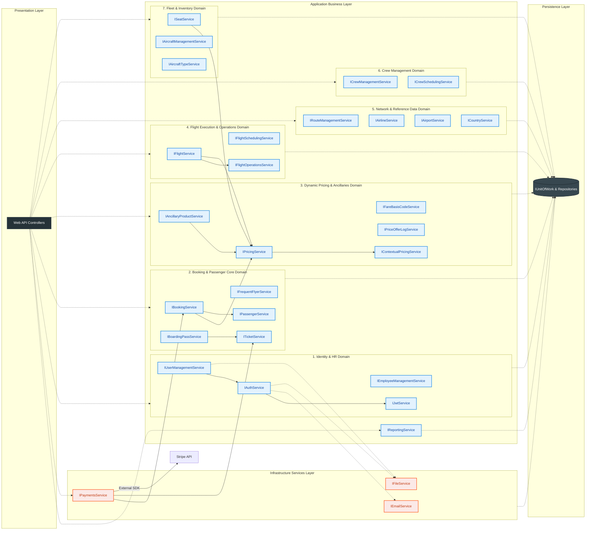

# Service Dependency Map

The **Asiaporeair** Application Layer is built on a modular Service-Oriented Architecture (SOA) within a Monolithic structure. Services communicate via interfaces (IService) to ensure testability and loose coupling. This document provides a comprehensive map of dependencies, illustrating how core business logic services interact and rely on the underlying persistence layer.
 
## 1. Comprehensive Dependency Visualization

 

  
> **Note: professional-grade experience** Comprehensive Dependency Visualization, we recommend using our Visualization on Mermaid.io diagram above.
   [**Comprehensive Dependency Visualization on Mermaid.io** ](https://www.mermaidchart.com/play?utm_source=mermaid_live_editor&utm_medium=toggle#pako:eNqNVg9vokgU_yoTm2zuEjRbbWvPSy4BhJatFQL0TGM3ZooPJaXgDbitud3vvu8BKlBoa9LqzPvNe-_3_s383_HiJXRGnW63-xB5ceQHq9FDxFi6hmcYMQHL7Wt3ycXTQ5RBVoJv1mxiE4YxL-RJMgafWQISiNIJ34FgfhCGo5P-xaA_uJSSVMRPMDoZDM-GZ36x7L4Ey3Q96m9eJS8OYzE68X3_75pOebMZx888iAqFMPD7_vKg8BQuL-G8VeHX5dmQn9Z1GpEveNlL_xH-guFBqe-fD_v9VqWP_uDiq1dXaoFIgiSFyINCa4VsLRSN3KVkzTcw8nZhoTzZPuahLiLL0yCO2PyhU1lnTB463_Mz9JEtYz6DR_pmahyhxTBE976PRqNyjvIDEC1r1rL4oJ9bL90KIHu1HQfEj8CDpMH0MhDgZW65ynH3VjYmc0PDPIbF2dIR3Zhoc0MPQngrs-T7uWHx3TP6nFTFB7-zFGQmJFIl4ZlSimvcsJ7CwDsEsrxUtkkQQfJ5VseAjRfXNqk77TFjia4G6Y59YbiX125FV5agO_d6bsjbdP2WMn2-zdy58e0lbZbeOZo9N-4SELc84iug4DQjtVuLwr4J4x3Ae-BDMCu8FNO8MaZXC9W0NaLX7zEljp-CaIXsLIw6RCtsIjXGmmhhqjhzozjT7KJiZQgulgghnc0wS3aoEAqTzRhdxzIS8N8WKerhrg3moiY38J7g03GwbEOlOMhTlcIw6LHxLuLPgYeNGXh5OOTIw67nIsC2aMv6VMWkF7idJeIl9lOzjypFhVoXXtMtDwszLaGhyLwH0BW0q3MBCscRpeKsb8ZNzKtcE5i-D2ISrz4bIH1iXF27C9NyKD5nPaaHwWqdMu0VvG3WN1-YuQGRNVprfHQkkh9s4eEcAd4aL6WwnbJ5gB7tfpbNVHNnpn2zsDWd6Jz32BTSl1g8IQsbMDLZkB_zlLcxsW_RvB1vU_ioQ2XDxskoBwK5QCvEyiCbWLSVi2vfU71scdbvPktTtbXZ4laeyldZc1_0mCrghR09bmOnEjvCfkTOUa9z4HvpaqsoTXMXxvRfbeqa9j05OKSyAkgxC0b0A43GYtfmIlWKA7wt6EQAA-oJ7qcfZsgtgd3dBj6gYFs4u22gZL3hewCWby66DCSc-BLNdQlH9vHRU4YpjoSzEm83R9J1yXWaUThjJJVgiFJUCVu6Gaej3ME_s0UPVrBEtUn_LInqqxmHtSBhmpuFaEAmPW3OYqjqgkMBUHs98iR7fpTfVm8v5ztzNv_DuIuC1PRn-y7dxEmABYLT-M_s2XPUUMsEvZG6ve4_-SVe2ytfgDVR6U6oSY7DsCYozZWapNSKb5RV-qAmxQDmO1Q6rIs7VEwFCH9lW1ha5R06R4-l-h69nfI9xcnO7f3fL2WnKFssw2zHLQD04KK1Ulsf5DlcPQQEr9GyAT2XYy1W1tbennNYszLbqtPHxKD1ih8_tdcURMRD5oxvfjInFcEG5vkXHaP62EPyg_l7LtOGxVWQLr-FqqLy86AqKd2LVUH5iqlKylO5rqw6EqtS6qXqTu3Rvhd2fv0GtqUlBQ) 

 

## 2. Architectural Principles and Layering

Our Application Services adhere to the **Dependency Inversion Principle (DIP)**, where high-level modules (Booking, Flight Search) depend on abstractions (Interfaces) rather than concrete implementations.

### Core Dependency: The Unit of Work

The foundational dependency for all data-manipulating services is the **`IUnitOfWork`**. It enforces atomicity, consistency, isolation, and durability (ACID) across business transactions by aggregating repository access and managing a single database transaction context.

> **Standard:** Every service within the `Application.Services` namespace that requires persistence operations **MUST** take `IUnitOfWork` as a constructor dependency.

## 3\. Service Catalog & Responsibilities

This table details the primary services, their responsibilities, and the key interfaces they rely on.

| Service Interface | Implementation | Primary Responsibility | Key Service Dependencies (Excluding UOW) | 
| :--- | :--- | :--- | :--- |
| **`IAuthService`** | `AuthService` | Manages core identity operations: user registration, login, profile updates, and authentication tokens. | `IJwtService`, `IEmailService`, `IFileService` |
| **`IJwtService`** | `JwtService` | Generates and validates JSON Web Tokens (JWTs) for authenticated users and manages claims/roles within the token. | *None (Relies on ASP.NET Identity Managers)* |
| **`IAircraftManagementService`** | `AircraftManagementService` | Manages the internal fleet inventory (Aircraft entities) and detailed seat map configurations for maintenance. | *None (Relies on UOW/Repositories)* |
| **`IAircraftTypeService`** | `AircraftTypeService` | Manages aircraft model definitions (e.g., range, capacity, manufacturer) and suitability checks for routes. | *None (Relies on UOW/Repositories)* |
| **`IAirlineService`** | `AirlineService` | Manages reference data for airlines (e.g., IATA/ICAO codes, operating region, base airport). | *None (Relies on UOW/Repositories)* |
| **`IAirportService`** | `AirportService` | Manages global airport reference data (IATA/ICAO codes, location, operational status). | *None (Relies on UOW/Repositories)* |
| **`IAncillaryProductService`** | `AncillaryProductService` | Managing add-ons (meals, wifi) and validation of product availability per flight. | *None (Relies heavily on UOW for data)* |
| **`IBoardingPassService`** | `BoardingPassService` | Handles the check-in process, generating the final Boarding Pass record and sequence number. | `ITicketService` |  
| **`IBookingService`** | `BookingService` | Manages the full lifecycle of a reservation (Create, Quote, Confirm, Cancel). Acts as the primary orchestrator for the booking flow. | `IPricingService`, `IPassengerService` | 
| **`IContextualPricingService`** | `ContextualPricingService` | Retrieves dynamic pricing attribute sets (e.g., time to departure, length of stay, special rules) for use by `IPricingService`. | *None (Relies on UOW/Repositories)* |
| **`ICountryService`** | `CountryService` | Manages core reference data for countries (ISO codes, continent) used for lookups and validation. | *None (Relies on UOW/Repositories)* |
| **`ICrewManagementService`** | `CrewManagementService` | Manages the flight crew profiles, qualifications, and certification records for operational purposes. | *None (Relies on UOW/Repositories)* |
| **`ICrewSchedulingService`** | `CrewSchedulingService` | Calculates and assigns qualified crew members to specific flight instances based on availability, base, and type rating checks. | *None (Relies heavily on UOW for data)* |
| **`IEmployeeManagementService`** | `EmployeeManagementService` | Handles HR and administrative management of non-flight employees, including profile creation and account activation/deactivation. | *None (Relies on UOW/Repositories)* |
| **`IFareBasisCodeService`** | `FareBasisCodeService` | Manages the static reference data for all ticket fare codes, defining their rules, restrictions, and price multipliers. | *None (Relies heavily on UOW for data)* |
| **`IFlightOperationsService`** | `FlightOperationsService` | Manages real-time flight instance updates (e.g., Gate assignment, Delays, Status: *Departed/Arrived*). | `IFlightSchedulingService` |  
| **`IFlightSchedulingService`** | `FlightSchedulingService` | Defines and manages the long-term, repeatable flight schedules, including creation of route segments and definitions. | *None (Relies heavily on UOW for data)* |
| **`IFlightService`** | `FlightService` | Customer-facing search for flight availability and retrieval of flight details. | `IPricingService`, `IFlightOperationsService` | 
| **`IFrequentFlyerService`** | `FrequentFlyerService` | Manages customer loyalty program accounts, handling points accrual, redemption, and membership level maintenance. | *None (Relies on UOW/Repositories)* |
| **`IPassengerService`** | `PassengerService` | Manages the creation, validation, and updating of individual passenger records (details, documents) linked to a booking. | *None (Relies on UOW/Repositories)* |
| **`IPriceOfferLogService`** | `PriceOfferLogService` | Records detailed historical logs of every calculated price offer or quote made to a customer for audit and analysis. | *None (Relies heavily on UOW for data)* |
| **`IPricingService`** | `PricingService` | Calculates dynamic fares based on base price, capacity, demand, and seat attributes. | `IContextualPricingService` | 
| **`IReportingService`** | `ReportingService` | Aggregates and analyzes data across core domains to generate various business intelligence and operational reports (e.g., Sales Summary, Passenger Manifests). | *None (Relies heavily on UOW for data)* |
| **`IRouteManagementService`** | `RouteManagementService` | Defines and manages flight routes (origin-destination pairs) and assigns specific operating airlines to each route. | *None (Relies heavily on UOW for data)* |
| **`ISeatService`** | `SeatService` | Manages seat inventory, selection, reservation, and real-time seat price calculation. | `IPricingService` |  
| **`ITicketService`** | `TicketService` | Finalizing the digital ticket record (E-Ticket) upon successful payment and linking it to the passenger/booking. | *None (Relies heavily on UOW for data)* |  
| **`IUserManagementService`** | `UserManagementService` | Administrative management of user accounts (roles, permissions, external password resets). | `IAuthService` | 
| **`IPaymentsService`** | `PaymentsService` | Interfacing with Stripe, managing refunds, and updating booking payment statuses. | `IBookingService`, `ITicketService`, `Stripe SDK` |
| **`IEmailService`** | `EmailService` | Handles reliable delivery of all system communications, including confirmations, password resets, and notifications. | *None (Infrastructure Service)* |
| **`IFileService`** | `FileService` | Manages secure storage, retrieval, and deletion of application assets (e.g., profile pictures, document uploads). | *None (Infrastructure Service)* |

> **Design Pattern:** We utilize the **Dependency Injection (DI)** pattern provided by ASP.NET Core. All services are registered in the IoC container (scoped lifetime) in `Presentation/Extensions/ServiceExtensions.cs`.

-----
  
## 4\. Design & Compliance Notes

### Dependency Injection Scope

All core application services are registered with a **Scoped** lifetime in `ServiceExtensions.cs`.

| Service Scope | Rationale |
| :--- | :--- |
| **`Scoped`** | Ensures that all dependencies within a single HTTP Request (or logical operation) receive the same instance of the service, including the same instance of the `IUnitOfWork`. This is crucial for transactional integrity during complex, multi-step operations like booking. |

### Anti-Corruption Layer (ACL)

The dependency of `IPricingService` on `IContextualPricingService` demonstrates an ACL pattern. `IPricingService` acts as a facade, protecting the application's core business logic from the specific, potentially external, or volatile logic of calculating pricing factors (e.g., promotional codes, external market data, or dynamic yield management rules). This separation enhances stability and maintainability.
 
  